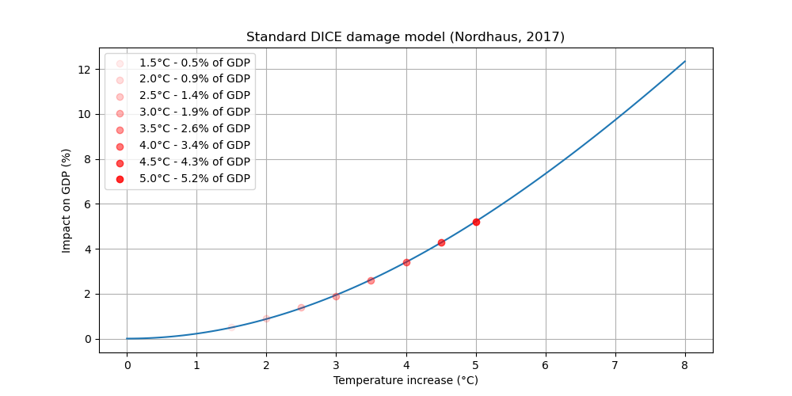

## Damage 
The relationship between global warming and its impact on economy is driven by the damage function. We have implemented two different equations for the damage model: 
* Standard DICE: the DICE model equation [^1] 
* Tipping point: a more drastic version with damage acceleration. 
You can choose between them by changing the input $tipping\_point$: if $tipping\_point = False$ then the standard DICE is used and if $tipping\_point = True$ the tipping point version is used. 

### Time Step 
The time step $t$ in each equation represents the period we are looking at. All inputs data are initialized from a year 2020 reference. The user can choose the year end and the duration of the period (in years) by changing the parameters $year\, end$ and $time \,step$. For example, for a year start at 2020, year end in 2100 and a duration of time step of 5 years we have $t \, \epsilon \,[0, 16]$.

### Standard DICE Damage
In DICE[^1] model, the damage function gives a relationship between temperature increase and economic damage. The fraction of output loss due to climate change $\Omega_t$ at $t$ is: 
$$\Omega_t = \pi_1 T_{t\,AT}+ \pi_2 T_{t\,AT}^\varepsilon$$ 
where $\pi_1$ and  $\pi_2$ are $damage\_int$ and $damage\_quad$ in the inputs. $T_{t\,AT}$ is the atmospheric temperature increase (see Temperature change model documentation). $\varepsilon$ ($damag\_expo$) represents the form of the relationship between temperature and economic damage. We set the default value to $\varepsilon = 2$, such that we have a quadratic relationship. It can be modified by changing the input $damag\_expo$.   
Total damage in trillions of dollars is then: 
$$Damages_t = \Omega _t. Y_t$$
with $Y_t$ the gross economic output in trillions of dollars (see macroeconomics documentation). 
The form of the damage fraction in the latest version of DICE (2017) is different between the documentation[^1] and the code[^3]. We chose to implement the equation from the code which is the one used to obtain the results. 
### Tipping point
We use another equation for the damage model from Weitzman (2009)[^2][^4] based on the assumption that once temperatures increase above a given point, damages may accelerate. In this version damages drastically increase after a temperature increase of 6°C. We have then:

$$ D_t = (\frac{T_{t\,AT}}{20.46})^2 + (\frac{T_{t\,AT}}{6.081})^{6.754} $$
and

$$\Omega_t = \frac{D_t}{1 + D_t}$$
As before, we have the total economics damage in trillions dollars:  
$$Damages_t = \Omega _t. Y_t$$

## Graphs

### Damage to productivity 
See the documentation of macroeconomics model. 

### References and notes 
[^1]: Nordhaus, W. D. (2017). Revisiting the social cost of carbon. Proceedings of the National Academy of Sciences, 114(7), 1518-1523.

[^2]: Weitzman, M. L. (2009). On modeling and interpreting the economics of catastrophic climate change. The Review of Economics and Statistics, 91(1), 1-19.

[^3]: Version of the code we use is "DICE-2016R-091916ap.gms" available at https://sites.google.com/site/williamdnordhaus/dice-rice. In the documentation (see [^1] ) $\Omega_t = \frac{1}{1+\pi_1 T_{t\,AT}+ \pi_2 T_{t\,AT}^\varepsilon}$. 

[^4]: Weitzman, M. L. (2012). GHG targets as insurance against catastrophic climate damages, National Bureau of Economic research (https://www.nber.org/system/files/working_papers/w16136/w16136.pdf )